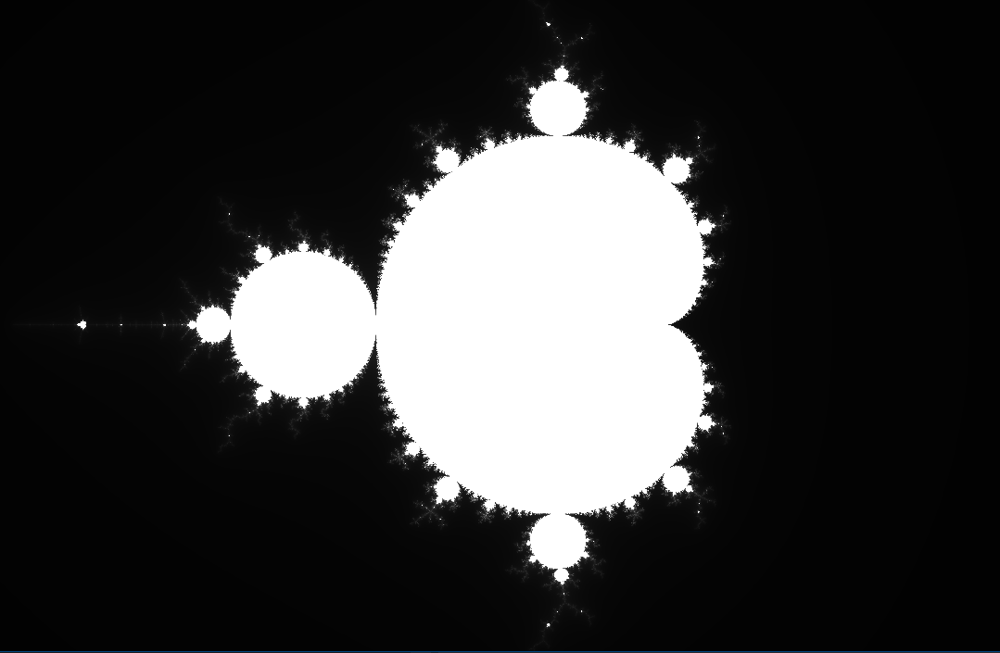
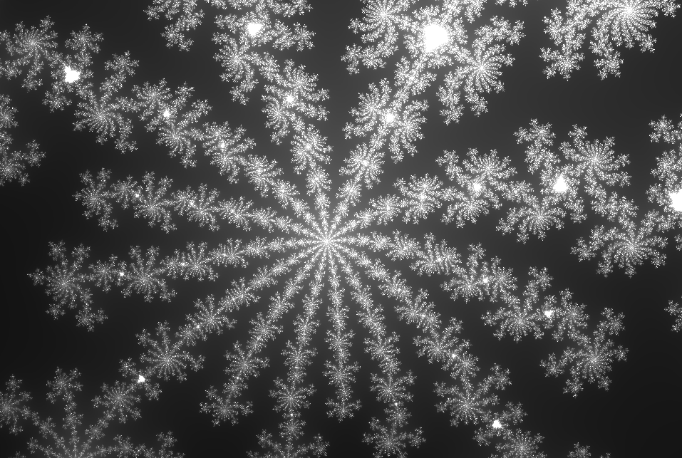
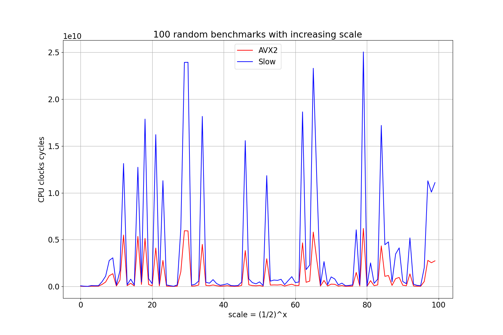

## Some Mandelbrot set drawing results



With a slightly larger zoom:




## Mandelbrot set drawing with AVX2 intrinsics

Because I did not want to compile SFML graphic lib from WSL to Windows, I Visual Studio, not bad, but Vim is better :)

SFML allowed to move across the screen with touchpad, mouse clicks (shift the center & zoom), mouse wheel scrolling, keyboard (+/- to zoom in/out); resize the screen and more and more.

Compiles with MSVC flags `/arch:AVX2 /O2`.

As you can see Slow version was vectorized:

From
```c
double x = 0, y = 0, x2 = 0, y2 = 0;

unsigned iteration = 0;
while (x2 + y2 <= RADIUS && iteration < ITERATIONS) {
    y = 2 * x * y + y0;
    x = x2 - y2 + x0;

    x2 = x * x;
    y2 = y * y;

    iteration++;
}
```

To

```c
vxorpd  xmm3, xmm3, xmm3
vxorpd  xmm1, xmm1, xmm1
vxorpd  xmm4, xmm4, xmm4
vxorpd  xmm2, xmm2, xmm2

vaddsd  xmm0, xmm1, xmm1
vmulsd  xmm1, xmm0, xmm4
vsubsd  xmm2, xmm2, xmm3
vaddsd  xmm4, xmm1, xmm6
vaddsd  xmm1, xmm2, xmm5
vmulsd  xmm2, xmm1, xmm1
vmulsd  xmm3, xmm4, xmm4
vaddsd  xmm0, xmm3, xmm2
```

But it is using only one `xmm` register (128 bits) per `double` point (64 bits).

Main idea of our optimization will take 4 double points (64 bits each) inside one `ymm` register (256 bits).

And we will get from our intrinsics version:
```c
while (iteration < ITERATIONS) {
    // true -> 0xffffff...; false -> 0x0000... 
    __m256d cmp_vector = _mm256_cmp_pd(_mm256_add_pd(x2, y2), radius_vector, _CMP_LE_OQ);

    if (_mm256_testz_pd(cmp_vector, cmp_vector)) {
        break;
    }
    
    iter_add_mask = _mm256_castpd_si256(cmp_vector);
    iter_vector = _mm256_add_epi64(iter_vector, iter_add_mask);

    // y = 2 * x * y + y0
    y = _mm256_mul_pd(_mm256_mul_pd(x, y), _mm256_set1_pd(2));
    y = _mm256_add_pd(y, y0);
    
    // x = x2 - y2 + x0
    x = _mm256_add_pd(_mm256_sub_pd(x2, y2), x0);

    // x2 = x * x
    x2 = _mm256_mul_pd(x, x);
    y2 = _mm256_mul_pd(y, y);

    iteration++;
}
```

This:

```c
  do
  {
    __asm
    {
      vaddpd  ymm0, ymm3, ymm2
      vcmple_oqpd ymm1, ymm0, ymm8
      vtestpd ymm1, ymm1
    }
    if ( _ZF )
      break;
    __asm
    {
      vmulpd  ymm0, ymm4, ymm7
      vmovupd ymm4, ymm9
      vfmadd231pd ymm4, ymm0, cs:__ymm@4000000000000000400000000000000040000000000000004000000000000000
      vsubpd  ymm0, ymm2, ymm3
    }
    ++v37;
    __asm
    {
      vaddpd  ymm7, ymm0, ymm5
      vmulpd  ymm2, ymm7, ymm7
      vpaddq  ymm6, ymm1, ymm6
      vmulpd  ymm3, ymm4, ymm4
    }
  }
  while ( v37 < 0x100 );
```

## Benchmarks

I ran 100 tests with scale increasing like `(1/2)^x` where x was the test number (Point to draw was taken randomly from [-1;1]x[-1;1] square).

Time measurements in processor cycles were performed via `__rdtsc` instruction.



And i have received the following perfomance gains estimates:

```
Median:  4.03x times faster
Avg:     3.79x times faster
```

This is pretty understandable, since we process 4 points in one iteration, instead of 1 point.


### Build instructions

TODO
